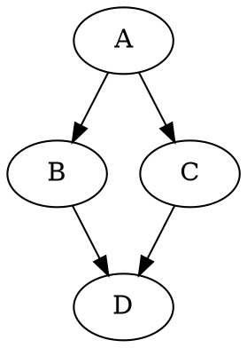

# DOT input

Package `se306.scheduler.io` (WBS 2.2). Source:
[`DotParser`](../src/main/java/se306/scheduler/io/DotParser.java),
[`JGraphTDotReader`](../src/main/java/se306/scheduler/io/JGraphTDotReader.java),
[`DotParseException`](../src/main/java/se306/scheduler/io/DotParseException.java). Reads a task
graph from a DOT file into a [`TaskGraph`](graph-model.md).

## The format

A task graph is a `digraph`. Nodes are tasks and their `Weight` is the execution time; edges are
dependencies and their `Weight` is the communication cost paid when the two tasks run on different
processors. `example.dot` in the repository root is the graph from the project description:



```
       A(2)
      /    \
    3/      \3
    B(3)    C(6)
      \    /
      2\  /8
       D(9)
```

The parser requires exactly this much and nothing more:

1. The file is valid DOT (the Graphviz grammar).
2. Every task has an integer `Weight` of at least 0 — on its own declaration, or inherited from an
   earlier `node [Weight=…]` default.
3. Every dependency has an integer `Weight` of at least 0.
4. Both ends of every dependency are tasks with a `Weight`. A name that only ever appears in an
   edge is reported as a task with no `Weight`.
5. The declarations form a task graph: no self-loops, no cycles, no task or edge declared twice with
   different weights (see [validation](graph-model.md#validation-in-build)).

## What is tolerated

Anything else that is legal DOT is accepted and ignored, so real Graphviz files work as input.
`test3.dot` in the repository root exercises all of it — the Figure 1 graph buried under noise:

| Accepted                                                    | Example                                  |
| ----------------------------------------------------------- | ---------------------------------------- |
| Block, line and hash comments                               | `/* … */`, `// …`, `# …`                 |
| `strict` header, named or unnamed graph                     | `strict digraph "g" {`, `digraph {`      |
| Graph, node and edge defaults                               | `graph [rankdir=LR]`, `node [shape=box]` |
| Standalone attribute statements                             | `ratio = compress;`                      |
| Subgraphs — flattened, a task inside one is an ordinary task | `subgraph cluster_x { b [Weight=2]; }`  |
| Attributes other than `Weight`, on tasks and edges          | `a [color=red, Weight=2, shape=box]`     |
| Quoted names, including spaces and leading digits           | `"task one"`, `"2nd"`                    |
| Quoted weights                                              | `b [Weight="3"]`                         |
| Missing semicolons, arbitrary whitespace, any order         | `b->d[Weight=2]` before `b` is declared  |
| Edge chains — each hop gets the attribute list              | `a -> b -> c [Weight=4]` is two edges of cost 4 |
| Identical redeclarations                                    | `a [Weight=1]; a [Weight=1];`            |

Three behaviours worth knowing that fall out of using a general DOT parser:

- An undirected graph is **not** rejected: `graph "g" { a -- b [Weight=1]; }` parses, with `--`
  read as `->` from left to right.
- A `node [Weight=5]` default really does give every later task without its own `Weight` an
  execution time of 5.
- Task index order is the order in which each task's `Weight` was first seen, not the order names
  are first mentioned — `z -> a [Weight=1]; z [Weight=1]; a [Weight=1];` gives `z` index 0 and `a`
  index 1.

Names are case-sensitive, and an unnamed digraph gets the graph name `graph`.

## How it works

```
DotParser.parse(Path | String)
  └─ JGraphTDotReader.read(String)            JGraphT DOTEventDrivenImporter, streamed
       └─ GraphBuilder.addNode / addEdge      name-keyed, mutable
            └─ GraphBuilder.build()           validate, freeze → TaskGraph
```

- **`DotParser`** is the public façade: `parse(Path)` reads the file as UTF-8, `parse(String)`
  parses text already in memory (the tests, the round-trip check). Both return a `TaskGraph`.
- **`JGraphTDotReader`** (package-private) drives JGraphT's `DOTEventDrivenImporter`
  (`org.jgrapht:jgrapht-io` 1.5.2). The importer *streams* events — a vertex, a vertex attribute, an
  edge, an edge attribute, a graph attribute — and never builds a JGraphT graph. Each `Weight` event
  is fed straight into a `GraphBuilder`; every other attribute is discarded. The graph's id is
  captured as the graph name. JGraphT is confined to this one class: nothing in `graph`, `schedule`
  or `algorithm` depends on it.
- Alongside the builder, the reader keeps two bookkeeping sets: every task and edge the importer
  *mentioned*, and the subset that *carried a `Weight`*. After the import, anything in the first set
  but not the second is an error. This is how requirement 4 is enforced, and why a typo can never
  silently shrink the graph.
- **`GraphBuilder.build()`** resolves names to indices, validates, and returns the frozen
  `TaskGraph`.

### Why JGraphT

The first version was a hand-rolled statement splitter. It was replaced (commit `d03df9a`,
2026-08-06) because the project specification requires everything Graphviz accepts to be tolerated,
and the DOT grammar — comments in three styles, quoted values, defaults, subgraphs, chains,
statements without semicolons — is more than a few regexes can handle reliably. Delegating to a
real parser means correctness comes from the library and our code is only the mapping to
`GraphBuilder`. The cost is `jgrapht-core` and `jgrapht-io` in the shaded jar, which is why the
event-driven importer is used rather than building a JGraphT graph and converting it: the library
is used only at the I/O boundary and never in the search.

## Errors

All of these reach the user as `Error: <message>` on stderr with exit status 1 (see
[CLI](cli.md#exit-status)).

| Problem                                    | Exception                   | Message                                                        |
| ------------------------------------------ | --------------------------- | -------------------------------------------------------------- |
| Not DOT at all / syntax error              | `DotParseException`         | `not valid DOT: Failed to import DOT graph: line 1:0 mismatched input 'this' expecting {STRICT, GRAPH, DIGRAPH}` |
| Task without a `Weight`                    | `DotParseException`         | `task 'b' has no Weight attribute.`                            |
| Dependency without a `Weight`              | `DotParseException`         | `dependency 'a -> b' has no Weight attribute.`                 |
| Edge to a name never declared as a task    | `DotParseException`         | `task 'b' has no Weight attribute.`                            |
| Non-integer `Weight`                       | `DotParseException`         | `Weight '2.5' of task 'a' is not an integer.`                  |
| Negative weight, conflicting redeclaration, self-loop, cycle | `GraphValidationException` | see [graph model](graph-model.md#validation-in-build) |
| File missing or unreadable                 | `IOException`               | reported by `Main` as `could not read 'INPUT.dot': …`          |

`DotParseException.line()` exists for callers that want a line number, but everything raised on this
path reports `0` — the importer does not expose positions for attribute events. Syntax errors carry
ANTLR's `line:col` inside the message text instead. Messages therefore name the task or edge rather
than the line; keep that convention when adding new checks.

## Tests

- [`DotParserTest`](../src/test/java/se306/scheduler/io/DotParserTest.java) — `example.dot` and
  `test2.dot`: the same diamond with different weights, so a weight read from the wrong place cannot
  pass both. Task count, weights, edge count, direction, absence of undeclared edges, costs.
- [`DotParserTest2`](../src/test/java/se306/scheduler/io/DotParserTest2.java) — `test3.dot`: the
  tolerated-noise list above, plus the graph name surviving a `strict` header.
- [`DotOutputWriterTest`](../src/test/java/se306/scheduler/io/DotOutputWriterTest.java) — parse →
  write → parse round trip, including quoted names.

The fixture files live in the **repository root** and are resolved through Maven's `basedir`
property (falling back to the working directory for IDE runs). Don't move or rename `example.dot`,
`test2.dot` or `test3.dot` without updating the tests.

## Changing the parser

- Keep the two halves of the contract intact: unknown syntax is ignored, but a task or dependency
  without a `Weight` is always an error.
- Keep JGraphT inside `JGraphTDotReader`. The search must never see a JGraphT type.
- Structural checks belong in `GraphBuilder.build()`, not here — the reader only knows about DOT.
- Add a new tolerated construct to `test3.dot` rather than a new fixture, so one file documents
  everything the parser must survive.
