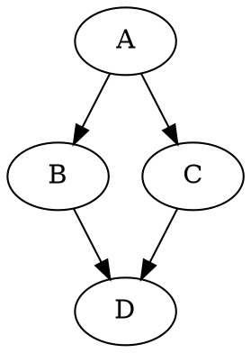

# DOT output

Package `se306.scheduler.io` (WBS 2.4). Source:
[`DotOutputWriter`](../src/main/java/se306/scheduler/io/DotOutputWriter.java). The counterpart to
[DOT input](dot-input.md) and the last stage of the pipeline: it takes the `TaskGraph` that was
parsed and the `Schedule` the search produced, and writes one file.

## The format

The output is the input graph with the schedule attached. Every task keeps its `Weight` and gains a
`Start` and a `Processor`; every dependency keeps its communication cost:



| Attribute   | On           | Meaning                                              |
| ----------- | ------------ | ---------------------------------------------------- |
| `Weight`    | task         | Execution time, copied from the input                |
| `Start`     | task         | Start time in the schedule                           |
| `Processor` | task         | Processor the task runs on, numbered **`1..P`**      |
| `Weight`    | dependency   | Communication cost, copied from the input            |

Conventions the writer guarantees:

- **Processors are 1-based in the file** (as in the project description) and 0-based everywhere
  inside the program (`Schedule.processor(task)`). The `+1` happens in `DotOutputWriter` and
  nowhere else; don't add another.
- **Order is deterministic.** Tasks come out in graph index order (the order their `Weight` was
  declared in the input), followed by every dependency, grouped by source task with successors in
  ascending index order. The same graph and schedule always produce byte-identical output, which is
  what makes the writer testable with string comparison.
- **Layout matches the sample inputs**: one tab of indentation, a tab-space gap before the attribute
  list, `\n` line endings on every platform (fixed, not `System.lineSeparator()`).
- **The graph name is preserved** (`digraph "example"`), always quoted. An input with no name comes
  out as `digraph "graph"`.
- **Names are quoted only when DOT requires it**: a name that is an ASCII letter or `_` followed by
  letters, digits and `_`, and is not a DOT keyword (`strict`, `graph`, `digraph`, `subgraph`,
  `node`, `edge`), is written bare; anything else (spaces, punctuation, a leading digit, non-ASCII)
  is quoted, with `"` and `\` escaped. A needlessly quoted `"A"` in the input therefore comes out as
  `A`, which is the same DOT.

## What is dropped

`TaskGraph` keeps only names, weights and edges, so nothing else from the input survives: comments,
`strict`, graph/node/edge defaults, colours, labels, shapes, subgraph groupings. None of it is part
of the required output. If a future feature needs to preserve any of it, it has to be carried
through `GraphBuilder` and `TaskGraph`; the writer never sees the original text.

## API

```java
public final class DotOutputWriter {
    public void   write(TaskGraph graph, Schedule schedule, Path output) throws IOException;
    public String toDot(TaskGraph graph, Schedule schedule);
}
```

- `write` renders with `toDot`, creates any missing parent directory (so `-o results/schedule.dot`
  works on a clean checkout), and writes UTF-8, replacing an existing file.
- `toDot` returns the text: used by the tests, and available for anything that wants the DOT
  without a file (e.g. the visualisation).
- Both throw `IllegalArgumentException` if `schedule.taskCount() != graph.taskCount()`. That is the
  writer's only validation: it trusts that `Schedule`'s constructor has already checked every task
  has a non-negative start on a processor that exists, and that the search respected precedence and
  overlap. The size check exists because a schedule for the wrong graph would otherwise produce a
  plausible-looking but meaningless file.
- `IOException` from `write` is reported by `Main` as `could not write 'OUTPUT': …`, exit 1.

## Round trip

The output is valid input: `Start` and `Processor` are just attributes the parser ignores, so
parsing an output file gives back a `TaskGraph` equal to the one it was written from. This is
tested, and it's worth keeping true: it's what lets you re-schedule a result and lets the tests
check the writer without golden files for every case.

## Tests

[`DotOutputWriterTest`](../src/test/java/se306/scheduler/io/DotOutputWriterTest.java) covers:
rendering tasks then dependencies with all attributes, 1-based processors across a `P`-processor
schedule, re-parsing the output into the original graph, quoting and escaping names that need it
(and their round trip), an empty graph, creating the file including a missing parent directory,
replacing an existing file, and rejecting a schedule of the wrong size.
